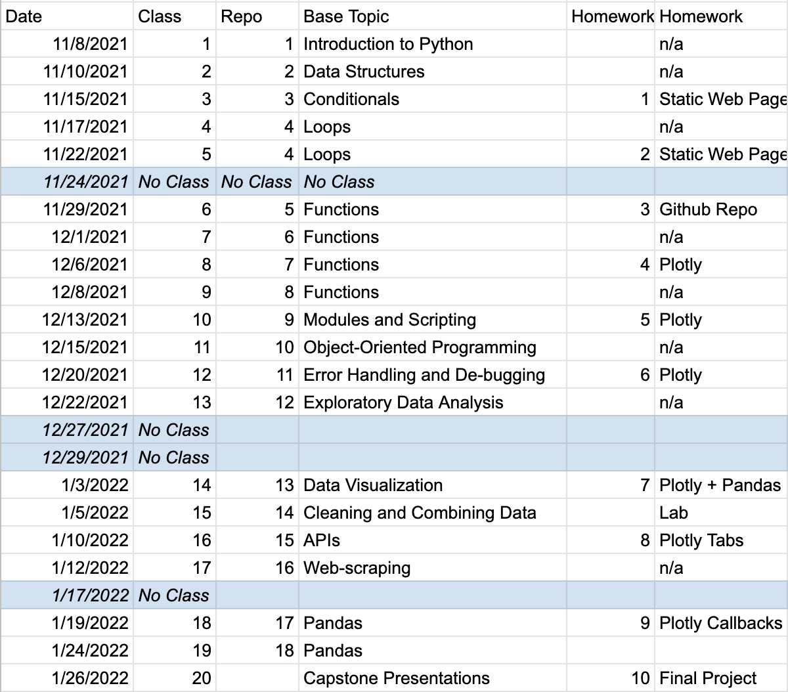

# Course Overview

## Youtube Recordings
|  Lesson |  Topic    | Recording | 
| --- | --- | --- |
| 1   | Introduction to Python  | [youtube link](https://youtu.be/mkcP2EisXcg) |
| 2   | Data Structures       | [youtube link](https://youtu.be/mkcP2EisXcg) |
| 3   | Conditionals   | [youtube link](https://youtu.be/mkcP2EisXcg) |
| 4   | Loops  | [youtube link](https://youtu.be/mkcP2EisXcg) |
| 4   | More Loops     | [youtube link](https://youtu.be/mkcP2EisXcg) |
| 5   | Functions Intro      | [youtube link](https://youtu.be/mkcP2EisXcg) |
| 6   | Functions Practice    | [youtube link](https://youtu.be/mkcP2EisXcg) |
| 7 |   Functions Intermediate   | [youtube link](https://youtu.be/mkcP2EisXcg) |
| 8   | Functions Advanced     | [youtube link](https://youtu.be/mkcP2EisXcg) |
| 9 |   Modules and Scripting   | [youtube link](https://youtu.be/mkcP2EisXcg) |
| 10 |  Object Oriented Programming    | [youtube link](https://youtu.be/mkcP2EisXcg) |
| 11 |      Debugging and Errors   | [youtube link](https://youtu.be/mkcP2EisXcg) |
| 12 |  Exploratory Data Analysis    | [youtube link](https://youtu.be/mkcP2EisXcg) |
| 13 |  Data Visualization     | [youtube link](https://youtu.be/mkcP2EisXcg) |
| 14 |  Cleaning and Combining Data     | [youtube link](https://youtu.be/mkcP2EisXcg) |
| 15 |  APIs    | [youtube link](https://youtu.be/mkcP2EisXcg) |
| 16  | Webscraping    | [youtube link](https://youtu.be/mkcP2EisXcg) |
| 17 |  Feature Engineering  | [youtube link](https://youtu.be/mkcP2EisXcg) |

#### Materials on Google Drive
[Click here](https://drive.google.com/drive/folders/15Ehp3HHZmpyPLrcpWQFnh0RP2lgsQNiF?usp=sharing)

#### Class Recordings:

| Date |	Repo |	Topic	 | Recording | Passcode |
| --- | --- | --- | --- | --- |
| 11/8/2021	| 1	| Introduction to Python	| [zoom link](https://generalassembly.zoom.us/rec/share/-WWYS1OzcdynQB_R5lX1PtdPwEI_AYL9EsvQhvcRWMpHXNjG3AFkk2gwkNEiDjpc.0bKu499-ruC3Sj2t ) | F2?z=r05 |
| 11/10/2021	| 2	| Data Structures	| [zoom link](https://generalassembly.zoom.us/rec/share/ziQYU-GU7UArwVWXfncqVXbRCPzeb5gz7rGf74OJGmuGL9JKqTs8ema5SIXtMrLz.T-d03Y7MImYS8Chk )| 1H.a+u55  |
| 11/15/2021	| 3	| Conditionals	| [zoom link](https://generalassembly.zoom.us/rec/share/1nwjj75IcPTi6__WGecocQjVapDA-laAUr1g4QUeh2f8kwQ7cV_-6590Rv3oacH0.aB4l8hx0K25ZsNGd) | g.!uw0cB |
| 11/17/2021	| 4	| Loops	| [zoom link](https://generalassembly.zoom.us/rec/share/CDcXPKYRTPoAWbvmnsS8pBjZIoJ5ib6-mrKT6jV7zOsmZDfap8esKjpmvVaAOvVT.keubPy0FGf9LwMkA) | mUG8GS@0 |
| 11/22/2021 |	4	| More Loops	| [zoom link](https://generalassembly.zoom.us/rec/share/Ls9H7lkgp0dpy0JkY4PVn4xoj50DAsn_o6kU2-qAeX-zsvc96Wbw4hT-lSGb9xam.wvlle-2n7tJjwQZA)  |  GTK5CBX*  |
| 11/24/2021 |	N/A | 	No Class	| | |
| 11/29/2021	| 5	| Functions Intro	| [zoom link](https://generalassembly.zoom.us/rec/share/6nznbpUKmhu2TocpCk1xuoJtmtO50dK0I7eQLiO9i88fsnr3NzXM52olcWlQNShE.P3gTrbS8anEUtbnH) | Passcode: Dg$V2dc7 |
| 12/1/2021	| 6	| Functions Practice	| [zoom link](https://generalassembly.zoom.us/rec/share/3Phx-BqjDL4d8g3okZMQwxY9AKNSOzQs5fUmM93xju0dKdMrPILyYowPAbdA7mCw.H6JJvJaMR6Vmy_V0 ) | Passcode: X&NczN9h  |
| 12/6/2021	| 7 |	Functions Intermediate	| [zoom link](https://generalassembly.zoom.us/rec/share/np86CPW4y3-5pgA8P8rEREIEYI4-TavfuVfCGGzxOowTogkkD-K0TQOrtthbMyid.GGYGLuis6s6zleep)  | Passcode: vps55&&b |
| 12/8/2021	| 8	| Functions Advanced	| [zoom link](https://generalassembly.zoom.us/rec/share/30SgZr2PbO_ydknhgS87VU-vq9lWEc-vrz8CkoUGD4nEdcK8fscJNKdERm222Ex8.-CDarPF9p6q7fNce) |  Passcode: YggK?Lw9 |
| 12/13/2021	| 9 | 	Modules and Scripting	| [zoom link](https://generalassembly.zoom.us/rec/share/KbH4JdF6OZld0w2Jcb58-6rZgnRYLzRYSBN25NVoI6IxbKTBW68oKjqMEGaxKpY1.fiXzlmPl2LDY6fRe) | Passcode: LM=LW5jb  |
| 12/15/2021	| 10 |	Object Oriented Programming	| [zoom link](https://generalassembly.zoom.us/rec/share/vVMYfBWy-Flvz8nU3UewwyEXi3toC632dM15us_k_xrn60DbCvfWPkBgT9MjxgU.Kq4Qd0ZNcBx1uUbc) | Passcode: ^PZ?!x=0   |
| 12/20/2021 | 11	 |	Debugging and Errors	| [zoom link](https://generalassembly.zoom.us/rec/share/d2Z_eIQ50uGBsBzW6gs6w8jez1ptz2eBpJNwOXZ6sOKV4sIBTCGyolA-AXmDcIQ.CIspwqYa2_eCMVm5) | Passcode: 8KjM%^KL  |
| 12/22/2021	| 12 |	Exploratory Data Analysis	| [zoom link](https://generalassembly.zoom.us/rec/share/V72eHuZmur__qWC-wBDs3m56mqQS8m0RkoZQ_bsVu4bAXJO16XRYOAVANpYt8zju.00vHao4p0qwCUr8Q) | Passcode: *?.jbK6#  |
| 12/27/2021	| N/A |	No Class	| | |
| 12/29/2021	| N/A | No Class	| | |
| 1/3/2022	| 13 |	Data Visualization	| [zoom link](https://generalassembly.zoom.us/rec/share/HnK__XttkzaHJlJZdDeEow-6IfFigXoB_H8QpcujObvcv_rpZRzufaHPpd5cREKG.ZjTEwKcKTZBAwVSp) |  Passcode: eAde2@&h |
| 1/5/2022	| 14 |	Cleaning and Combining Data	| [zoom link](https://generalassembly.zoom.us/rec/share/Jkdy9QYW67QJblZ_s6YRZtSPawfsUPeep4Qnueerkf1sTUIr6n7MJ4L8pL1aZdVu.jTV-NBTB2xzQk6Xs) |  Passcode: 8c44.m0C  |
| 1/10/2022	| 15 |	APIs	| [zoom link](https://generalassembly.zoom.us/rec/share/yoxU8zf-GQL8FQvElA03ojdxmFQ7hzsf76FqvFsAiKUDXJXKc_xuZslzQbB62ILi.H00ph1DCMUMCcOZu) | Passcode: +!01#i+L |
| 1/12/2022	| 16  |	Webscraping	| [zoom link](https://generalassembly.zoom.us/rec/share/CaT9baPR37CmjuJN5zzcz3o_jGkU1a6LJoET7vcVq8wHedTjkPTxEZHZFRME1vXO.v5tJs7xZ1VT5B0DP) | Passcode: .5J1gNBF |
| 1/19/2022	| 17 |	Capstone prep	| [zoom link](https://generalassembly.zoom.us/rec/share/2RCZ7QFCl0PzgInYtEyI_WmEs6i9dAu3nsdR1kAX1JAa1wJxBC__Ks0WasI64xc.ZBcl3VyQik8oJmAg) | Passcode: r^k7n$d4  |
| 1/24/2022	| 18 |	Capstone prep	| [zoom link](https://generalassembly.zoom.us/rec/share/50b7pMjlKhXgHTMXQnay3p3OKKe1ZH2ITEUIxdGuQHTnK-AD3LiTi597OtFbyI4w.D4nbURFYvEW3IGcK) |  Passcode: 3h&q#@9U |
| 1/26/2022	| 19 |	Capstone Presentations	| [zoom link](https://generalassembly.zoom.us/rec/share/zHKH_B6NqdDUab1blqpR_9g9K6cy9SIpov-zNEvW17zf8hNPjqFkSgONdvrHFhWO.V6l78SqwgGjFPp4k) | Passcode: dAC4!xiA |
